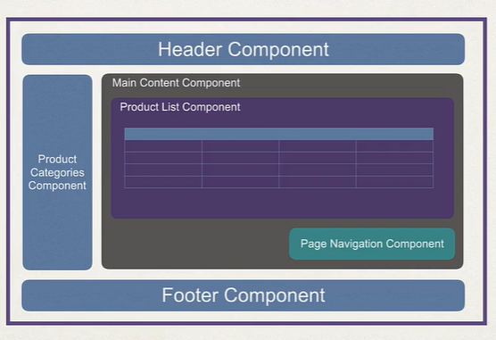

# A full stack development

- Pathway to learn the development in angular to develop websites

## What is angular?

- It is a framework for building modern single-page
  applications. [angular](https://angular.dev/overview)

## Difference between a single page and traditional application

### Traditional application

- Each user action results in a full HTML page load

  

### Single page application

- A web application that is composed of a single page.
- Based on user action, the application page is updated.
- Normally performs a partial update instead of full page load.

  

- Angular supports the single page application development

## Angular History


## Angular Development

- For the development, we can develop using various languages
    - JavaScript: extremely popular
    - ECMAScript 6: modern version of JavaScript ES6, ES9
    - TypeScript: add optional types to JavaScript

- Relationships:
    - TypeScript is a superset of JavaScript and ECMAScript

      

- Component based framework.
- Clean separation of template coding and application logic.
- Built-in support for data-binding and dependency injection.
- Supports responsive web design and modern frameworks.

## Why the usage of frameworks instead of DIY with JavaScript,

- Hard to maintain and manage the code
- Frameworks provide a structure to the code
- Frameworks provide a set of libraries to build the application
- Frameworks provide a set of tools to build the application
- Frameworks provide a set of best practices to build the application
- Frameworks provide a set of guidelines to build the application
- It helps in the data binding, routing, and other features

## Setup the development environment

- The development environment is set up using the following tools

    - Node.js
    - npm
    - Angular CLI
    - Visual Studio Code

- Install Node.js

    - Download the Node.js from the official website [Node.js](https://nodejs.org/en/)
    - Install the Node.js
    - Verify the installation using the following command

      ```bash
      node -v
      npm -v
      ```
- Final setup
  link: [Setup](https://github.com/darbyluv2code/fullstack-angular-and-springboot/blob/master/install-angular-tools/ms-windows/install-ms-windows.md)

## What is TypeScript?

- TypeScript is a superset of JavaScript
    - Language developed by Microsoft in 2012
    - Free and open-source programming language
- TypeScript is a statically typed language
    - Helps in catching errors at compile time
- TypeScript is a strongly typed language
- Add support for classes, interfaces, and modules
- Classes, interfaces, and modules help in organizing the code
- Website link: [TypeScript](https://www.typescriptlang.org/)

## Development process for typescript

- File have the .ts extension
- Add it in the 01-basics.ts file

```typescript
console.log("Hello World");
```

- Compile the file using the following command,

```bash
tsc 01-basics.ts

# Provide the flag to avoid the errors
tsc --noEmitOnError 01-basics.ts

# Compiler flag
tsc --target ES5 --noEmitOnError 01-basics.ts

```

- To many compiler configs will be difficult to manage
- Create a tsconfig.json file

```json
{
  "compilerOptions": {
    "target": "ES5",
    "noEmitOnError": true
  }
}
```

- Run the following command to compile the file

```bash

tsc --init # To create the tsconfig.json file in the path

# After that to compile the  project
tsc

```

``

- The above command will generate the 01-basics.js file and the process is called `transpiling`

- Run the file using the following command,

```bash

node 01-basics.js

```

-- The compiler can find the errors at the compile time

## Typescript variables

| Type    | Description                                               |
|---------|-----------------------------------------------------------|
| var     | function-scoped, can be re-declared and updated           |
| let     | block-scoped, cannot be re-declared but can be updated    |
| const   | block-scoped, cannot be re-declared and cannot be updated |
| boolean | true or false                                             |
| number  | integer or floating point number                          |
| string  | sequence of characters                                    |
| any     | any type                                                  |

## Typescript brush up

- The [01-basics.ts](typescript-beginner-tutorial/01-basics/01-basics.ts) consists of the basic
  typescript code for the beginners
- The basics of code organization, [modules](typescript-beginner-tutorial/02-modules/Driver.ts)
- Supports inheritance, [inheritance](typescript-beginner-tutorial/03-inheritance/Driver.ts)
    - The class can inherit the properties and methods from the parent class
    - The class can override the properties and methods from the parent class
    - Subclasses can have their own properties and methods and can add new properties and methods
    - Support abstract classes
    - It only supports single inheritance
    - Can implement multiple interfaces
- Abstract classes, [abstract classes](typescript-beginner-tutorial/04-abstract-classes/Driver.ts)
    - Abstract classes cannot be instantiated
    - Abstract classes can have abstract methods
    - Abstract methods must be implemented in the concrete subclass
- Interfaces, [interfaces](typescript-beginner-tutorial/05-interfaces/Driver.ts)
    - Define an interface with a method contract
    - Classes can implement the interface according to the contract
    - A class can implement multiple interfaces
    - It can also use interfaces to support contracts with properties

  ```typescript
  
  // interface with properties example
  
  interface Person {
    firstName: string;
    lastName: string;
  }
  
  function greeter(person: Person) {
    return "Hello, " + person.firstName + " " + person.lastName;
  }
  
  let user = { firstName: "Jane", lastName: "User" };
  ```

## Angular Architecture


- The architecture consists of the following components
    - Modules
    - Components
    - Templates
    - Metadata
    - Data binding
    - Directives
    - Services
    - Dependency injection
    - Routing
    - Observables

## Key components of Angular

| Term          | Description                                                                                                                     |
|---------------|---------------------------------------------------------------------------------------------------------------------------------|
| Components    | Main player and has 2 parts: 1. View for user interface, 2. Class that contains application logic / event handling for the view |
| View Template | HTML that determines the UI of the application                                                                                  |
| Directives    | Add behavior to an existing DOM element or transform the DOM element                                                            |
| Services      | Provides functionality that can be shared across the components                                                                 |
| Modules       | Group of related components, directives, services, and pipes that are related to an application                                 |

## Application UI Composition



## Application Interaction


## Angular project

- It consists of multiple files: HTML, CSS, TypeScript, Configuration, Images, and other assets

## Create an Angular project

- Create an Angular project using the following command,

```bash

npm install --location=global @angular/cli@14.0.7

ng version

ng help

ng new angular-hello-world

cd angular-hello-world

# Run the application
ng serve 

# open

ng serve --open

cd angular-hello-world/src/app
```

## Angular loading principle


## Angular sales project setup

- The project setup is done using the following steps,

```bash

ng new sales-ui-app

cd sales-ui-app

ng serve --open

cd sales-ui-app/src/app

# Create a new component
ng generate component sales-person-list

# Create a new class for the sales person
ng generate class SalesPerson
```

## Bootstrap files for CSS

- Bootstrap website: [Bootstrap](https://getbootstrap.com/)
- Instructions are provided in the website to install the bootstrap

```bash

npm i bootstrap@5.3.3

```

## Angular Coding

- Uses public properties to bind to the view entirely different from the java world
- Most commonly used structural directives are `*ngIf` and `*ngFor`,
  example: [sales-person-list-bootstrap.component.html](sales-ui-app/src/app/sales-person-list/sales-person-list-bootstrap.component.html)
- Also, there are other directives such
  as, [angular-directives](https://angular.io/guide/structural-directives)
    - `ngClass`, `ngStyle`, `ngModel`, `ngForm`, `ngSubmit`,
    - `ngModelGroup`, `ngSwitch`, `ngSwitchCase`, `ngSwitchDefault`, `ngTemplateOutlet`,
    - `ngContainer`, `ngContent`, `ngForOf`, `ngForTrackBy`, `ngForTemplate`, `ngIf`,
    - `ngIfThen`, `ngIfElse`, `ngPlural`, `ngPluralCase`, `ngStyle`, `ngClass`,
    - `ngComponentOutlet`, `ngTemplateOutlet`, `ngContainer`, `ngContent`,
    - `ngNonBindable`, `ngProject`

  ```angular2html
  
  <!-- ngIf and ngfor example -->
  <div *ngIf="salesPersons.length > 0">
    <table class="table table-striped">
      <thead>
        <tr>
          <th>First Name</th>
          <th>Last Name</th>
          <th>Email</th>
          <th>Sales</th>
        </tr>
      </thead>
      <tbody>
        <tr *ngFor="let person of salesPersons">
          <td>{{person.firstName}}</td>
          <td>{{person.lastName}}</td>
          <td>{{person.email}}</td>
          <td>{{person.salesVolume}}</td>
        </tr>
      </tbody>
    </table>
  </div>
  
  ```
- Currency format is done using the `currency` [pipe](https://angular.io/api/common/CurrencyPipe)

  ```angular2html
  
  <td>{{person.salesVolume | currency:'USD'}}</td>
    
  ```
- Other pipes available are: `date`, `decimal`, `percent`, `json`, `async`, `uppercase`, `lowercase`, `titlecase`, `slice`, `number`, `percent`, `currency`, `date`, `i18nPlural`, `i18nSelect`, `async`, `keyvalue`, `json`, `slice`, `titlecase`, `uppercase`, `lowercase`, `date`, `number`, `percent`, `currency`, `i18nPlural`, `i18nSelect`, `keyvalue`

## Reference

- Project reference: git clone https://github.com/darbyluv2code/fullstack-angular-and-springboot.git
